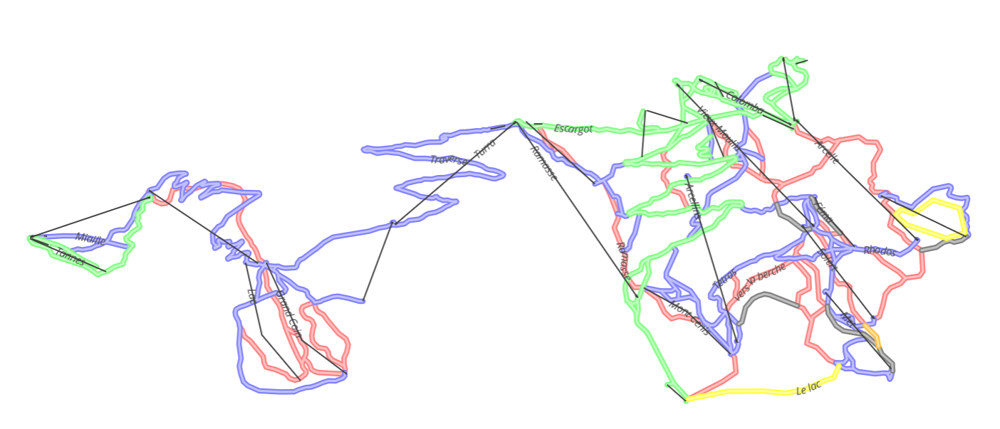

# osm-ski-planetgenerator

This is a generator that produce vector tiles that represent ski data on
a given area.



## Usage

Just git clone the project then run make !

```bash
git clone https://github.com/API-K-Lab/osm-ski-planetgenerator.git
make
```

This will compute France. The output will be in `data` directory. To
compute any other area, just use :

```bash
# to generate France :
make ski-france
# to generate Europe :
make ski-europe
# to generate Planet :
make ski-planet
```

If you want to optimize generation, you can pass options like using
`PLANETILER_OPTIONS` var, like this :

```bash
# to generate Planet :
make ski-planet PLANETILER_OPTIONS=-Xmx16g
```

Please report to planetiler documentation for more information.

Finally, if you use WSL Linux distribution, you could have to specify
the `CURDIR` var in the commande :

```bash
# to generate Planet :
make ski-planet PLANETILER_OPTIONS=-Xmx16g CURDIR="$(pwd)"
```

## Performances

### Planetiler

First of all, this project use [Planetiler](https://github.com/onthegomap/planetiler)
which is really a performant tool to generate vector tiles.

By the way, i did some tests just to verify that performances were
amazing. And they are !

### France

On my machine (i7-9700 / 16Go RAM / 2To NVMe SSD), it took 
approximatively 4 minutes to process the whole France after it has been
completely downloaded.

The result with 1G RAM dedicated :

```
0:00:00 INF [download] - Starting...
0:08:41 INF [osm_pass1] - Starting...
0:11:20 INF [osm_pass2] - Starting...
0:12:44 INF [sort] - Starting...
0:12:46 INF [mbtiles] - Starting...
0:12:47 INF - FINISHED!
```

The size of mbtiles file is less than 7 MB !

### Europe

The generation of Europe with 16G RAM on a D8S_v5 Azure VM took about 12
minutes, plus 2 for download. The resulting size is approx 54MB !

### Planet

The generation of Planet with 16G RAM on a D8S_v5 Azure VM took about 31
minutes once pbf has been downloaded. The resulting size is 69MB !